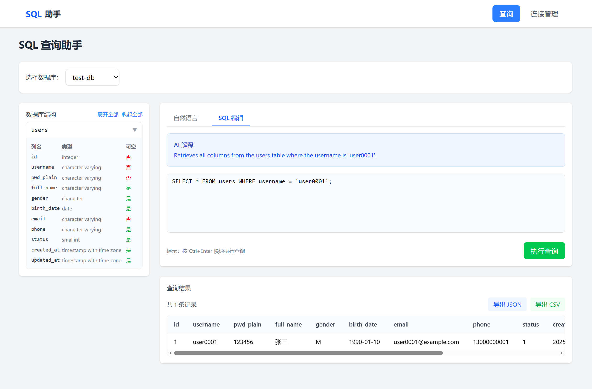

# Natural Language to SQL Query Demo

一个自然语言转 SQL 查询的 Demo 应用。用户输入自然语言描述，系统通过 LLM 生成对应的 SQL 查询语句，用户确认后可执行查询并查看结果。



## 功能特性

### 核心功能
- **数据库连接管理**: 添加、测试、删除 PostgreSQL 数据库连接
- **自然语言转 SQL**: 输入自然语言描述，AI 自动生成 SQL 查询语句
- **SQL 执行**: 执行生成的 SQL 并以表格形式展示结果
- **Schema 查看**: 查看数据库表结构信息

### 扩展功能
- **Tab 切换输入**: 支持自然语言输入和直接编写 SQL 两种模式
- **查询结果导出**: 支持导出为 JSON 或 CSV 格式

## 技术栈

### 后端
- Python (FastAPI)
- SQLite (存储数据库连接配置)
- PostgreSQL 客户端 (psycopg2)
- LLM API (OpenAI 兼容接口)

### 前端
- React + TypeScript
- Vite
- Tailwind CSS
- Axios

## 项目结构

```
w2_dbquery/
├── backend/
│   ├── main.py              # FastAPI 入口
│   ├── config.py            # 配置管理
│   ├── database.py          # SQLite 连接管理
│   ├── routers/
│   │   ├── connections.py   # 连接管理路由
│   │   └── query.py         # 查询相关路由
│   ├── services/
│   │   ├── llm.py           # LLM 调用服务
│   │   ├── postgres.py      # PostgreSQL 操作
│   │   └── sql_validator.py # SQL 验证
│   └── models/
│       └── schemas.py       # Pydantic 模型
├── frontend/
│   ├── src/
│   │   ├── components/      # React 组件
│   │   ├── pages/           # 页面组件
│   │   ├── services/        # API 调用
│   │   ├── types/           # TypeScript 类型
│   │   └── utils/           # 工具函数
│   └── package.json
├── spec/                    # 需求规格文档
├── assets/                  # 静态资源
└── pyproject.toml
```

## 快速开始

### 环境要求
- Python 3.11+
- Node.js 18+
- uv (Python 包管理器)

### 1. 克隆项目
```bash
git clone <repository-url>
cd w2_dbquery
```

### 2. 配置环境变量
```bash
cp .env.example .env
```

编辑 `.env` 文件，配置以下参数：
```env
# LLM 配置
LLM_API_KEY=<Your LLM API KEY>
LLM_MODEL=<Your LLM Model Name>
LLM_BASE_URL=<Your LLM API Base URL>

# 数据库
SQLITE_DB_PATH=

# 查询限制
MAX_QUERY_ROWS=1000

# CORS
CORS_ORIGINS=http://localhost:5173,http://localhost:3000
```

### 3. 启动后端服务
```bash
# 安装依赖
uv sync

# 启动 API 服务
uv run uvicorn backend.main:app --reload
```

后端服务将在 http://localhost:8000 启动。

### 4. 启动前端服务
```bash
cd frontend

# 安装依赖
npm install

# 启动开发服务器
npm run dev
```

前端服务将在 http://localhost:5173 启动。

## API 接口

### 连接管理
| 方法 | 端点 | 描述 |
|------|------|------|
| POST | `/api/connections` | 添加新连接 |
| GET | `/api/connections` | 获取所有连接 |
| DELETE | `/api/connections/{id}` | 删除连接 |
| POST | `/api/connections/{id}/test` | 测试连接 |
| GET | `/api/connections/{id}/schema` | 获取数据库 Schema |

### 查询操作
| 方法 | 端点 | 描述 |
|------|------|------|
| POST | `/api/generate-sql` | 自然语言生成 SQL |
| POST | `/api/execute-sql` | 执行 SQL 查询 |

## 使用说明

### 1. 添加数据库连接
1. 点击导航栏的「连接管理」
2. 输入连接名称和 PostgreSQL 连接字符串
3. 点击「测试连接」验证连接是否正常
4. 点击「添加连接」保存

### 2. 使用自然语言查询
1. 在首页选择数据库连接
2. 在「自然语言」Tab 输入查询描述，如："查询所有用户的姓名和邮箱"
3. 点击「生成 SQL」或按 Ctrl+Enter
4. 系统自动切换到「SQL 编辑」Tab，显示生成的 SQL
5. 可编辑 SQL 后点击「执行查询」

### 3. 直接编写 SQL
1. 切换到「SQL 编辑」Tab
2. 直接输入 SQL 查询语句
3. 点击「执行查询」或按 Ctrl+Enter

### 4. 导出查询结果
1. 执行查询后，在结果区域点击「导出 JSON」或「导出 CSV」
2. 文件将自动下载到本地

## 安全限制

- 仅允许执行 SELECT 查询语句
- 禁止 INSERT/UPDATE/DELETE/DROP/ALTER 等操作
- 查询结果行数限制（默认最多 1000 行）

## 开发文档

详细的开发规格文档位于 `spec/` 目录：
- `instructions.md` - 项目概述和功能说明
- `spec-back-end-day-one.dev.md` - 后端开发规格
- `spec-front-end-day-one.dev.md` - 前端开发规格
- `feature_tab_switch_for_sql_input.md` - Tab 切换功能规格
- `FEATURE_EXPORT.md` - 导出功能规格

## License

MIT
